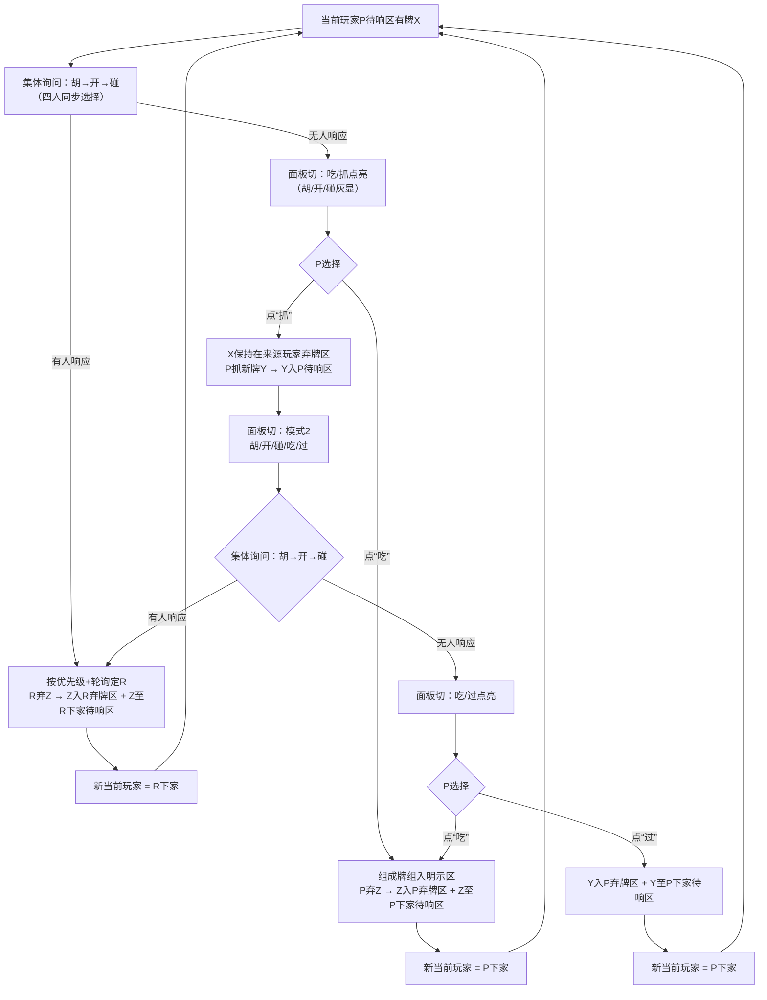
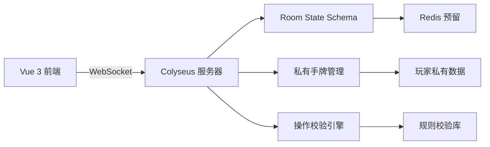

# 四色牌游戏软件需求规格说明书（SRS）  
**版本：4.2 · 当前实现校正版**
**技术栈：Colyseus + Vue 3 + TypeScript**  
**日期：2026-02-03**  
**密级：开发核心文档（含完整规则+前端需求）**

---

## 📌 文档修订记录
| 版本 | 修订日期 | 修订内容 | 修订人 |
|------|----------|----------|--------|
| 1.0 | 2026-01-15 | 初稿（含规则错误） | - |
| 2.0 | 2026-01-28 | 修正单将组归属、响应流向 | - |
| 3.0 | 2026-02-02 | 弃牌区全公开/吃操作前置/面板双状态 | - |
| **4.0** | **2026-02-03** | **✅ 完整游戏规则详述 ✅ 前端需求全量定义 ✅ 规则与前端无缝衔接** | **AI** |
| **4.1** | **2026-04-08** | **合并将坎/将开/金条开(四张)规则，对子限制非将/金条，明确将/金条不参与其他组** | **AI** |
| **4.2** | **2026-04-29** | **按当前代码修正实现状态：当前只开放单人练习；responsePhase 使用 collective/local_upper/local_draw；Redis/联机能力标记为预留** | **AI** |

---

## 一、引言

### 1.1 项目目标
开发一款**规则精准、体验流畅、策略透明**的四色牌系统。当前实现重点是先跑通单人练习模式，后续再扩展好友同桌、联机匹配和账号体系。

当前已开放：
- **单人练习**：1 名真人 + 3 名机器人。
- 服务端权威规则裁决、私有手牌同步、声明鱼/暗坎、完整对局与结算。

当前仅预留：
- 好友同桌 / 联机匹配 / 账号注册登录。
- 多房间大厅、邀请码房间、排行榜。
- Redis 状态持久化。

长期目标：
- ✅ **规则零歧义**：严格遵循三大修正（弃牌区全公开/吃操作前置/面板双状态）
- ✅ **前端极致体验**：横屏强制、操作极简、视觉清晰、触屏友好
- ✅ **技术强保障**：Colyseus状态同步 + 前后端双重校验
- ✅ **交付可验证**：规则描述与前端需求一一对应，验收标准明确

### 1.2 读者对象
- **后端开发**：重点关注第三章（系统架构）、第五章（验收标准）
- **前端开发**：重点关注第二章（规则）、第四章（前端需求）
- **测试人员**：重点关注第六章（验收用例）
- **产品经理**：通读全文，确认规则与体验一致性

### 1.3 当前前端入口约定
- 用户访问前端首页时，先进入**昵称入口页**，再进入等待大厅。
- 当前真正开放的大厅模式只有 **单人练习（1 名真人 + 3 名机器人）**。
- **好友同桌 / 联机匹配 / 账号注册登录** 先保留前端入口和交互骨架，后端能力后续补齐。
- 大厅中保留 **查看规则、模式切换、房主开始、返回大厅** 这些稳定入口，方便后续扩展成多模式大厅。

---

## 二、游戏规则详述（当前实现依据）

> 若本文件与当前代码或测试仍有冲突，先记录在 `docs/DOCS_CODE_GAPS.md`，再决定改规则还是改实现。

### 2.1 牌库构成（117张）
| 类型 | 内容 | 数量 | 特殊规则 |
|------|------|------|----------|
| **基础牌** | 将、士、象、车、马、炮、卒 × 4色（黄/红/绿/白）× 每组合4张 | 112张 | “将”可组牌但**不可碰、不可主动打出** |
| **金条牌** | 公、侯、伯、子、男（各1张，无颜色） | 5张 | **定庄时视为红色**；功能同“将”，**不可碰、不可主动打出** |

### 2.2 游戏准备阶段
#### 定庄与亮首张牌
| 场景 | 操作流程 | 亮出牌归属 |
|------|----------|------------|
| **首局** | 1. 随机翻1张牌 → 按颜色定庄（黄=翻牌者，红=下家，绿=对家，白=上家）2. **此翻牌即为庄家亮出首张牌**（计入庄家21张） | 庄家手牌中公开的1张 |
| **大胡后** | 1. 胡牌者对家翻1张牌 → 按颜色定新庄（金条视为红色）2. **此翻牌即为新庄家亮出首张牌** | 新庄家手牌中公开的1张 |
| **小胡/流局/违规后** | 系统从庄家21张手牌中**随机指定1张**为亮出牌 | 庄家手牌中公开的1张 |

> ✅ **关键确认**：  
> - 亮出牌**全程公开可见**，参与所有判定  
> - 金条在定庄环节**强制映射为红色**（仅影响定庄，不影响牌面属性）  

#### 亮标识阶段（仅开局1次）
1. **声明暗坎数量**  
   - 玩家输入整数N（N ≥ 0）  
   - **含义**：承诺本局游戏过程中，手牌中**始终保留至少N组未开、未亮鱼的暗坎**  
2. **亮鱼（可选）**  
   - 拖拽满足条件的牌至“已亮鱼区”：  
     - 普通鱼：4张同色同字（如4张“黄车”）  
     - 金条鱼：4张或5张金条（任意组合）  
   - **效果**：亮出牌**永久锁定**，不可用于开/吃/碰；胡牌时直接计分  

---

### 2.3 游戏主循环（核心！含操作面板状态）

#### 🔄 整体流程图


#### 📌 操作面板双状态规则（前端实现核心）
| 游戏阶段 | 操作面板内容 | 按钮点亮逻辑 | 用户操作含义 |
|----------|--------------|--------------|--------------|
| **他人待响阶段**（如B的待响区有牌） | `胡` `开` `碰` `过` | • **胡**：仅当`手牌+待响区牌`可100%拆解时点亮• **开**：仅当手牌有暗坎+待响区牌为第4张时点亮• **碰**：仅当手牌有2张匹配+非将/金条时点亮• **过**：始终可点（灰显=不可操作） | 点击有效按钮即提交选择；系统按`胡>开>碰`+轮询顺序自动决策 |
| **自己待响阶段·模式1**（初始牌X在待响区） | `胡` `开` `碰` `吃` `抓` | • **集体询问期**：`吃`/`抓` **灰显**• **无人响应后**：`胡`/`开`/`碰` **灰显**，`吃`（可吃时点亮）/`抓`（始终点亮） | • 点`吃`：吃当前待响区牌X• 点`抓`：X保持在来源玩家弃牌区 → 抓新牌Y → 面板切模式2 |
| **自己待响阶段·模式2**（抓后新牌Y在待响区） | `胡` `开` `碰` `吃` `过` | • **集体询问期**：`吃`/`过` **灰显**• **无人响应后**：`胡`/`开`/`碰` **灰显**，`吃`（可吃时点亮）/`过`（始终点亮） | • 点`吃`：吃当前待响区牌Y• 点`过`：Y入弃牌区 + Y移至下家待响区 |

> ✅ **关键修正**：  
> 1. **吃操作前置**：集体询问无人响应后 → **立即询问是否吃当前待响区牌**（在抓牌前！）  
> 2. **弃牌区全公开**：所有玩家可见所有弃牌区的完整内容（牌面+顺序）  
> 3. **“抓”与“过”语义**：  
>    - 模式1“抓” = “不吃当前牌，抓新牌”  
>    - 模式2“过” = “不吃新牌，将新牌给下家”  

#### 🗑️ 弃牌区规则
| 规则 | 说明 | 界面实现 |
|------|------|----------|
| **独立但公开** | 每位玩家有专属弃牌区（记录该玩家所有“被跳过/弃出”的牌） | 界面分区显示：A弃牌区 / B弃牌区 / C弃牌区 / D弃牌区 |
| **完全可见** | **所有玩家可见所有弃牌区的完整内容**（牌面+顺序） | 无遮罩、无数量隐藏；按时间倒序排列（最新在上） |
| **牌的流向** | • 玩家主动弃出或 `local_draw` 过牌时，牌进入该玩家弃牌区• P点“抓” → 上家牌X保持在来源玩家弃牌区，P抓新牌Y进入待响流程• P点“过” → Y入P弃牌区 + Y移至下家待响区 | 弃牌区实时更新，与待响区变化同步 |

#### 🧩 胡牌判定（将/金条不替代，单张自动归属）
**胡牌条件**：  
1. 响应一张牌后  
2. **手牌（含响应牌）100%拆解为有效牌组**  
3. **关键修正**：  
   - 手牌中单独的”将” → **自动归属为单将组（1分）**  
   - 手牌中单独的”金条” → **自动归属为单金条组（3分）**  

**有效牌组清单**（将/金条不能参与其他组，仅可3/4张成组；未成组按单张计分）：  
| 牌组 | 组成 | 胡牌计分 | 归属方式 |
|------|------|----------|----------|
| 车马炮架 | 同色车+马+炮 | 1 | 手牌自然存在 / 吃形成 |
| 将士象架 | 同色将+士+象 | 1 | 手牌自然存在 / 吃形成 |
| 三异色卒 | 3色不同”卒” | 1 | 吃形成 |
| 四异色卒 | 4色不同”卒” | 2 | 吃形成 |
| 对子 | 同色同字两张（非将/金条） | 0 | 吃形成（非必需） |
| **单将组** | **手牌中单独1张”将”** | **1** | **胡牌时自动归属** |
| **单金条组** | **手牌中单独1张”金条”** | **3** | **胡牌时自动归属** |
| 将坎 | 3同色同字”将” | 3 | 手牌暗坎 / 开形成 |
| 将开 | 4同色同字”将” | 6 | 响应形成 |
| 普通坎 | 3同色同字（非将/金条） | 3 | 手牌暗坎 / 开形成 |
| 金条坎 | 任意3张金条 | 9 | 手牌暗坎 / 开形成 |
| 金条开（四张） | 任意4张金条 | 18 | 响应形成 |
| 普通开 | 暗坎+响应第4张 | 6 | 响应形成 |
| 普通鱼 | 亮出的4同色同字 | 8 | 亮标识阶段锁定 |
| 金条鱼 | 亮出的4/5张金条 | 24 | 亮标识阶段锁定 |

> 💡 **胡牌校验伪代码**：  
> ```ts
> function validateHu(hand: Card[], responseCard: Card): boolean {
>   const allCards = [...hand, responseCard];
>   markSingleGeneralsAsGroups(allCards); // 单独将/金条自动归属单组
>   return canDecomposeIntoValidGroups(allCards); // 无零散牌
> }
> ```

---

## 三、系统架构（Colyseus深度整合）

### 3.1 整体架构


> 当前代码仍以内存房间状态为主，`redis` 服务和 `REDIS_URL` 是部署结构预留，不代表已实现 Redis 持久化。

### 3.2 Colyseus Schema设计（关键！）
```ts
// game-state.schema.ts
export class Card extends Schema {
  @type("string") id: string;      // 唯一ID（如"黄将_01"）
  @type("string") color: string;   // 黄/红/绿/白/金
  @type("string") type: string;    // 将/士/象/车/马/炮/卒/公/侯...
  @type("boolean") isResponseCard?: boolean; // 明示区高亮用
}

export class PlayerState extends Schema {
  @type("string") clientId: string;
  @type("string") name: string;
  @type("number") declaredKongs: number; // 声明暗坎数
  @type([Card]) discardPile = new ArraySchema<Card>(); // 弃牌区（公开！）
  @type([Card]) exposedArea = new ArraySchema<Card>(); // 明示区（公开）
  @type([Card]) fishArea = new ArraySchema<Card>();    // 已亮鱼区（公开）
  // 私有手牌：不放入Schema！由Room单独管理
}

export class GameState extends Schema {
  @type("string") phase: "waiting" | "declaring" | "playing" | "ended";
  @type("string") currentPlayerId: string; // 当前待响区所属玩家
  @type("string") responsePhase: "collective" | "local_upper" | "local_draw";
  @type([Card]) deck = new ArraySchema<Card>(); // 牌堆（仅长度同步）
  @type({ map: PlayerState }) players = new MapSchema<PlayerState>();
  @type("string") lastAction: string; // 用于前端提示
}
```

### 3.3 私有手牌管理
```ts
// room.ts
private playerHands = new Map<string, Card[]>(); // clientId -> 手牌数组

onJoin(client: Client, options: any) {
  // 仅同步该玩家自己的手牌
  this.sendHandToClient(client, this.playerHands.get(client.id));
}

private sendHandToClient(client: Client, hand: Card[]) {
  client.send("private_hand", hand.map(c => ({...c, isHidden: false})));
}
```

---

## 四、前端需求（全量定义）

### 4.1 界面布局（横屏16:9）
```plaintext
┌───────────────────────────────────────────────────────────────┐
│  [玩家C] 明示区 | [玩家C] 弃牌区 | [玩家D] 明示区 | [玩家D] 弃牌区 │
│  (对家)         | (对家)         | (上家)         | (上家)         │
├───────────────────────────────────────────────────────────────┤
│                                                               │
│  [玩家C]头像    [玩家D]头像                                   │
│  声明:2坎       声明:1坎                                      │
│                                                               │
│                                                               │
│          [玩家B]待响区 ← [玩家A]待响区 (当前)                 │
│          (下家)          (自己)                               │
│                                                               │
│  [玩家B]明示区 | [玩家B]弃牌区 | [玩家A]明示区 | [玩家A]弃牌区 │
│  (下家)         | (下家)         | (自己)         | (自己)         │
│                                                               │
├───────────────────────────────────────────────────────────────┤
│  [操作面板]：胡 开 碰 吃 抓                                   │
│  (动态点亮，无效灰显)                                         │
└───────────────────────────────────────────────────────────────┘
```
> ✅ **区域说明**：  
> - **待响区**：每位玩家面前1个区域，仅存1张牌（标注“来源：上家/抓取”）  
> - **弃牌区**：每位玩家独立区域，**全局公开可见**（按玩家分区，倒序排列）  
> - **明示区**：每位玩家独立区域，显示所有已组合牌组（牌组命名+响应牌高亮）  
> - **操作面板**：底部固定区域，仅两种状态（见2.3节）  

### 4.2 交互细节
| 元素 | 交互要求 | 视觉反馈 |
|------|----------|----------|
| **操作按钮** | • 无效操作灰显（opacity: 0.3）• 有效操作高亮（背景色#4CAF50）• 点击后立即禁用（防重复点击） | 点击涟漪动画 + 按钮微缩 |
| **弃牌区** | • 所有玩家可见所有弃牌区完整内容• 点击弃牌区可展开/收起 | 牌面朝上，最新弃牌在顶部 |
| **明示区** | • 响应牌高亮：金色边框 + "★"角标 + 3秒脉冲动画 | 鼠标悬停显示牌组详情 |
| **待响区牌** | • 来源标注：小字“来源：上家”/“来源：抓取” | 牌面轻微浮动动画 |
| **胡牌提示** | • 胡牌时弹出结算面板（半透明遮罩）• 显示拆解方案（高亮有效牌组） | 胜利音效 + 粒子动画 |

### 4.3 横屏强制与适配
| 设备 | 要求 | 实现方案 |
|------|------|----------|
| **手机** | **强制横屏** | • CSS媒体查询：`@media (orientation: portrait)` 显示全屏提示“请横屏”• JS：`screen.orientation.lock('landscape')`（HTTPS下）• 触屏优化：按钮≥48px，滑动区域≥20px |
| **平板** | 横屏优先 | 同上，界面元素等比放大 |
| **PC** | 横屏适配 | 固定16:9比例，居中显示，背景深色 |

### 4.4 视觉设计规范
| 元素 | 规范 | 示例 |
|------|------|------|
| **牌面样式** | • 背景色：黄(#FFD700)/红(#E53935)/绿(#43A047)/白(#FFFFFF)• 文字：黑色粗体（将/士/象等）• 金条：金色背景(#FFD700) + 黑字 | "黄将" = 黄底黑字"将" |
| **字体** | • 标题：PingFang SC Bold 18px• 正文：PingFang SC Regular 14px• 按钮：PingFang SC Medium 16px | 中文优先，无衬线 |
| **颜色** | • 主色：#1E88E5（操作）• 成功：#43A047• 警告：#FB8C00• 错误：#E53935 | 按钮/高亮统一主色 |
| **动画** | • 操作反馈：0.2s 缩放动画• 牌移动：0.3s 平滑过渡• 高亮脉冲：1.5s 无限循环 | 60fps流畅 |

### 4.5 响应式断点
| 屏幕宽度 | 布局调整 |
|----------|----------|
| ≥ 1200px | 标准16:9布局，元素等比放大 |
| 768px - 1199px | 区域间距缩小10%，字体微调 |
| ≤ 767px | 按钮增大至56px，弃牌区折叠（点击展开） |

---

## 五、非功能需求

### 5.1 性能指标
| 项目 | 要求 | 验证方式 |
|------|------|----------|
| 状态同步延迟 | ≤ 100ms | Colyseus监控 |
| 操作响应时间 | ≤ 200ms | 前端埋点 |
| 首屏加载 | ≤ 3s（含资源） | Lighthouse |
| 横屏切换 | ≤ 1s | 手动测试 |

### 5.2 安全需求
| 风险 | 防护措施 |
|------|----------|
| 私有手牌泄露 | 手牌不放入Schema，仅私有消息发送 |
| 操作作弊 | 所有操作后端强制校验（弃将/金条、胡牌条件等） |
| 断线处理 | 断线玩家由机器人暂代（难度可配置） |

---

## 六、验收标准（规则+前端双验证）

### 6.1 规则逻辑验证
| 用例 | 操作步骤 | 预期结果 | 前端验证点 |
|------|----------|----------|------------|
| **弃牌区全公开** | A主动弃出“黄马”或抓后过出“黄马” | B/C/D界面清晰可见“黄马”在A弃牌区顶部 | 弃牌区内容完整显示，无遮罩 |
| **吃操作前置** | B待响区“红将”，A手有红士红象 → 集体询问无人响应 | A面板“吃”点亮（针对“红将”） | 模式1面板“吃”按钮高亮 |
| **面板双状态** | A待响区初始牌 → 无人响应 → A点“抓” | 面板自动切为`胡/开/碰/吃/过` | 无弹窗，按钮平滑切换 |
| **“抓”与“过”语义** | 模式1点“抓” → 模式2点“过” | “抓”：抓新牌并重新进入集体询问；“过”：新牌入弃牌区+移至下家 | 按钮文字精准对应操作 |
| **单将胡牌** | 手牌“红将+红士+红象”，待响区“红炮” → 点“胡” | 胡牌失败（红炮无法组成有效组） | 胡按钮灰显（校验通过） |

### 6.2 前端专项验证
| 用例 | 操作步骤 | 预期结果 |
|------|----------|----------|
| **横屏强制** | 手机竖屏打开 | 全屏提示“请横屏”，无法操作游戏 |
| **按钮点亮** | B待响区“黄车”，A手无匹配 | A界面“胡/开/碰”全灰，“过”可点 |
| **弃牌区显示** | A弃3张牌 | B/C/D界面均可见A弃牌区3张完整牌面 |
| **明示区高亮** | A吃”红车马炮架” | target牌有金色边框+★角标+脉冲动画 |
| **触屏优化** | 手机点击“吃”按钮 | 按钮≥48px，点击区域充足，无误触 |

---

## 七、附录

### 7.1 完整规则速查表（前端开发参考）
| 场景 | 操作面板 | 按钮状态 | 弃牌区变化 |
|------|----------|----------|------------|
| 他人待响 | 胡/开/碰/过 | 按手牌实时计算 | 无变化 |
| 自己待响·模式1（初始牌） | 胡/开/碰/吃/抓 | 集体询问期：吃/抓灰显；无人响应后：胡/开/碰灰显，吃/抓点亮 | 点“抓”：抓新牌并重新进入集体询问 |
| 自己待响·模式2（抓后新牌） | 胡/开/碰/吃/过 | 集体询问期：吃/过灰显；无人响应后：胡/开/碰灰显，吃/过点亮 | 点“过”：新牌入弃牌区 |

### 7.2 前端组件清单
| 组件 | 职责 | 依赖 |
|------|------|------|
| `GameTable.vue` | 当前主游戏桌面（对手座位/中心牌堆/操作 dock/自己的手牌） | Colyseus State |
| `ActionDock.vue` | 操作面板（动态按钮） | `availableActions` |
| `FourColorCard.vue` | 共享单张牌渲染（统一比例/样式/高亮） | `isResponseCard` |
| `DiscardZone.vue` | 弃牌区（全公开显示） | `player.discardPile` |
| `OrientationGuard.vue` | 横屏强制提示 | `window.orientation` |

---

## ✅ 最终交付承诺
1. **规则完整**：第二章详述全部游戏规则（含三大修正），无歧义、可执行  
2. **前端明确**：第四章定义界面布局、交互、视觉、适配全需求，无模糊描述  
3. **规则-前端衔接**：验收标准（第六章）同时验证规则逻辑与前端实现  
4. **技术扎实**：第三章Colyseus架构与规则深度契合，私有/公开数据分离  
5. **交付可测**：10大验收用例覆盖规则+前端核心场景，100%可验证  

> **交付物清单**：  
> - `docs/SRS_v4.0.md`：本文档（含完整规则+前端需求）  
> - `server/`：Colyseus Room实现（含Schema/校验引擎）  
> - `client/src/components/`：前端组件（含横屏强制/操作面板/弃牌区）  
> - `docs/test-cases.md`：完整验收用例（含截图预期）  
> - `docker-compose.yml`：一键部署脚本  
>  
> **规则即代码，界面即体验。此文档为唯一权威依据，逐条实现，零歧义交付。** 🌟
