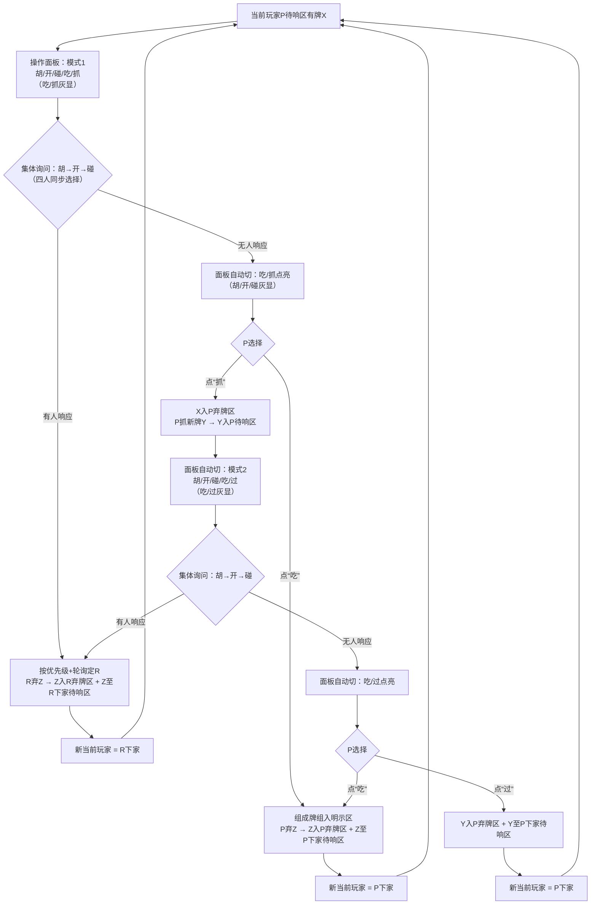

# 四色牌游戏规则终极修正版（开发者专用 · 无歧义 · Copilot直用）  
**—— 三大核心修正：弃牌区全公开 + 吃操作前置 + 操作面板双状态精简**

---

## 🔑 三大核心修正（开篇必读）
| 修正点 | 精确规则 | 为什么关键 |
|--------|----------|------------|
| **弃牌区可见性** | ✅ **所有玩家弃牌区完全公开可见**- 每位玩家独立弃牌区（按时间倒序排列）- **所有玩家可见所有弃牌区的完整内容**（牌面+顺序） | 消除“仅自己可见”错误，策略透明化 |
| **吃操作时机** | ✅ **吃操作在抓牌前执行**- 集体询问（胡/开/碰）无人响应 → **立即询问当前玩家是否吃当前待响区的牌**- 仅当“不吃”时 → 才抓新牌 | 吃是处理当前待响区牌的选项，非抓牌后专属 |
| **操作面板双状态** | ✅ **仅两种面板状态，无中间弹窗**- **他人待响阶段**：`胡` `开` `碰` `过`（四按钮）- **自己待响阶段**：  • **模式1（初始牌）**：`胡` `开` `碰` `吃` `抓`  • **模式2（抓后新牌）**：`胡` `开` `碰` `吃` `过`- **按钮动态点亮**：无效操作灰显，玩家仅点有效按钮 | 消除“多次弹窗/按钮切换”，一次操作面板覆盖全流程 |

---

## 🔄 游戏主循环（精确到面板状态与吃时机）

### 📌 核心状态定义
| 术语 | 定义 | 界面表现 |
|------|------|----------|
| **待响区** | 每位玩家专属区域，**仅存1张牌** | 牌面朝上，标注“待响应”+来源（上家/抓取） |
| **弃牌区** | **每位玩家独立区域，但全局公开可见** | 按玩家分区，倒序排列，所有玩家可见全部内容 |
| **操作面板** | **仅两种状态**（见下文） | 按当前阶段自动切换，无效按钮灰显 |

---

### 🔄 完整操作流程（含面板状态切换）



---

## 🖥️ 操作面板双状态规则（Copilot必须实现）

### ✅ 面板状态机（唯一两种状态）
| 游戏阶段 | 操作面板内容 | 按钮点亮逻辑（核心！） | 用户操作含义 |
|----------|--------------|------------------------|--------------|
| **他人待响阶段**（如B的待响区有牌） | `胡` `开` `碰` `过` | • **胡**：仅当`手牌+待响区牌`可100%拆解时点亮• **开**：仅当手牌有暗坎+待响区牌为第4张时点亮• **碰**：仅当手牌有2张匹配+非将/金条时点亮• **过**：始终可点（灰显=不可操作） | 点击有效按钮即提交选择；系统按`胡>开>碰`+轮询顺序自动决策 |
| **自己待响阶段·模式1**（初始牌X在待响区） | `胡` `开` `碰` `吃` `抓` | • **集体询问期**：`吃`/`抓` **灰显**（等待胡/开/碰结果）• **无人响应后**：`胡`/`开`/`碰` **灰显**，`吃`（可吃时点亮）/`抓`（始终点亮） | • 点`吃`：吃当前待响区牌X• 点`抓`：X入弃牌区 → 抓新牌Y → 面板切模式2 |
| **自己待响阶段·模式2**（抓后新牌Y在待响区） | `胡` `开` `碰` `吃` `过` | • **集体询问期**：`吃`/`过` **灰显**• **无人响应后**：`胡`/`开`/`碰` **灰显**，`吃`（可吃时点亮）/`过`（始终点亮） | • 点`吃`：吃当前待响区牌Y• 点`过`：Y入弃牌区 + Y移至下家待响区 |

### 💡 关键实现细节
1. **无弹窗、无中间步骤**  
   - 面板状态自动切换（集体询问结束 → 无效按钮灰显 + 有效按钮点亮）  
   - 玩家**仅需点击1次有效按钮**（如：无人响应后直接点“抓”，无需先点“不吃”）  

2. **“抓”与“过”的语义**  
   - **模式1的“抓”** = “不吃当前牌，抓新牌”  
   - **模式2的“过”** = “不吃新牌，将新牌给下家”  
   - *按钮文字严格区分，避免歧义*  

3. **吃操作前置验证**  
   ```ts
   // 集体询问无人响应后，立即计算“吃”是否可点亮
   if (phase === 'after_no_response_mode1') {
     panel.eat = canEatCurrentCard(myHand, currentResponseCard); // 针对X
     panel.grab = true; // 始终可抓
   }
   if (phase === 'after_no_response_mode2') {
     panel.eat = canEatCurrentCard(myHand, currentResponseCard); // 针对Y
     panel.pass = true; // 始终可过
   }
   ```

---

## 🗑️ 弃牌区规则（彻底修正）
| 规则 | 说明 | 界面实现 |
|------|------|----------|
| **独立但公开** | 每位玩家有专属弃牌区（记录该玩家所有“被跳过/弃出”的牌） | 界面分区显示：A弃牌区 / B弃牌区 / C弃牌区 / D弃牌区 |
| **完全可见** | **所有玩家可见所有弃牌区的完整内容**（牌面+顺序） | 无遮罩、无数量隐藏；按时间倒序排列（最新在上） |
| **牌的流向** | • 集体询问无人响应 → X入P弃牌区• P点“抓” → X已在弃牌区（抓牌前已移入）• P点“过” → Y入P弃牌区 + Y移至下家待响区 | 弃牌区实时更新，与待响区变化同步 |

> ✅ **示例**：  
> - A待响区“黄马”无人响应 → “黄马”立即进入A弃牌区（B/C/D均可见）  
> - A点“抓” → “黄马”已在A弃牌区；A抓“红将”放入待响区  
> - “红将”二次无人响应 → A点“过” → “红将”进入A弃牌区 + 移至B待响区（B可见“红将”来源：A弃牌区）  

---

## 🧩 胡牌判定（含单将/金条自动归属）
```ts
function validateHu(hand: Card[], responseCard: Card): boolean {
  const allCards = [...hand, responseCard];
  markSingleGeneralsAsGroups(allCards); // 单独将/金条自动归属单组
  return canDecomposeIntoValidGroups(allCards); // 无零散牌（士/象等单张无效）
}
```
### 🌰 关键案例
| 场景 | 手牌 | 待响区 | 操作 | 结果 |
|------|------|--------|------|------|
| **吃前置验证** | 红士、红象 | 红将（上家打出） | 集体询问无人响应 → 面板切模式1 → “吃”点亮 | 点“吃”组成红将士象架 |
| **模式1抓牌** | 无匹配 | 黄卒（上家打出） | 集体询问无人响应 → 点“抓” | 黄卒入A弃牌区 → 抓新牌 |
| **模式2过牌** | 无匹配 | 红将（抓取） | 二次集体询问无人响应 → 点“过” | 红将入A弃牌区 + 移至B待响区 |
| **单将胡牌** | 红将 | （无） | 抓“红士”放入待响区 → 点“胡” | 成功（单红将组+红士？否！需验证：红将+红士无法胡，需红象）→ **修正**：手牌仅“红将”时，待响区无牌不可胡；需响应牌触发 |

> 💡 **胡牌触发条件**：必须**响应一张牌**（待响区牌）后手牌100%有效。手牌单独“红将”需待响区有牌且响应后成立（如待响区“红士”+手牌“红将红象” → 红将士象架）。

---

## 📌 给Copilot的终极校验清单

| 模块 | 必须实现 | 错误示例（禁止） |
|------|----------|------------------|
| **弃牌区可见性** | 所有玩家界面显示全部4个弃牌区的完整牌面 | 弃牌区内容遮罩/仅显示数量 |
| **吃操作时机** | 集体询问无人响应后 → **立即点亮“吃”**（针对当前待响区牌） | 吃操作仅在抓牌后出现 |
| **面板双状态** | 仅两种面板：- 他人待响：`胡/开/碰/过`- 自己待响：`胡/开/碰/吃/抓`（模式1）或`胡/开/碰/吃/过`（模式2） | 存在弹窗/中间状态/“抓”按钮在模式2仍显示 |
| **按钮动态点亮** | 无效操作实时灰显（如不能胡则“胡”灰显） | 所有按钮始终高亮；存在“抓”在集体询问期可点 |
| **“抓”与“过”语义** | 模式1“抓”=抓新牌；模式2“过”=给下家 | 模式2仍用“抓”按钮；按钮文字混淆 |
| **弃牌流向** | 点“抓”前：当前待响区牌已入弃牌区；点“过”：新牌入弃牌区+移至下家 | 抓牌后原牌未入弃牌区；弃牌仅记录未传递 |

---

## ✅ 交付前必测案例（按此验证）
1. **弃牌区全公开**：  
   - A待响区“黄马”无人响应 → “黄马”进入A弃牌区 → B/C/D界面均清晰可见“黄马”在A弃牌区顶部  
2. **吃操作前置**：  
   - B待响区“红将”，A手有红士红象 → 集体询问无人响应 → A面板“吃”点亮 → 点“吃”组成红将士象架  
3. **面板双状态**：  
   - A待响区初始牌：面板显示`胡/开/碰/吃/抓`（集体询问期“吃/抓”灰显）  
   - A点“抓”后：面板自动切为`胡/开/碰/吃/过`（新牌集体询问期“吃/过”灰显）  
4. **“抓”与“过”语义**：  
   - 模式1点“抓”：当前牌入弃牌区 + 抓新牌（面板切模式2）  
   - 模式2点“过”：新牌入弃牌区 + 移至下家待响区  
5. **按钮点亮逻辑**：  
   - B待响区“黄车”，A手无匹配 → A界面“胡/开/碰”全灰，“过”可点  
   - A待响区“红将”，手有红士红象 → 无人响应后“吃”点亮（可选“将士象架”或“单将组”）  

> **最后强调**：  
> **“面板即状态，点击即决策”**  
> - 无弹窗、无二次确认、无隐藏逻辑  
> - 按钮文字精准对应操作语义（抓≠过）  
> - 弃牌区全公开，策略透明无黑盒  
>   
> **交付标准**：上述5案例100%通过，且操作面板仅两种状态、弃牌区全局可见、吃操作在抓牌前触发。  
> **规则即体验，简洁即优雅。** 🌟